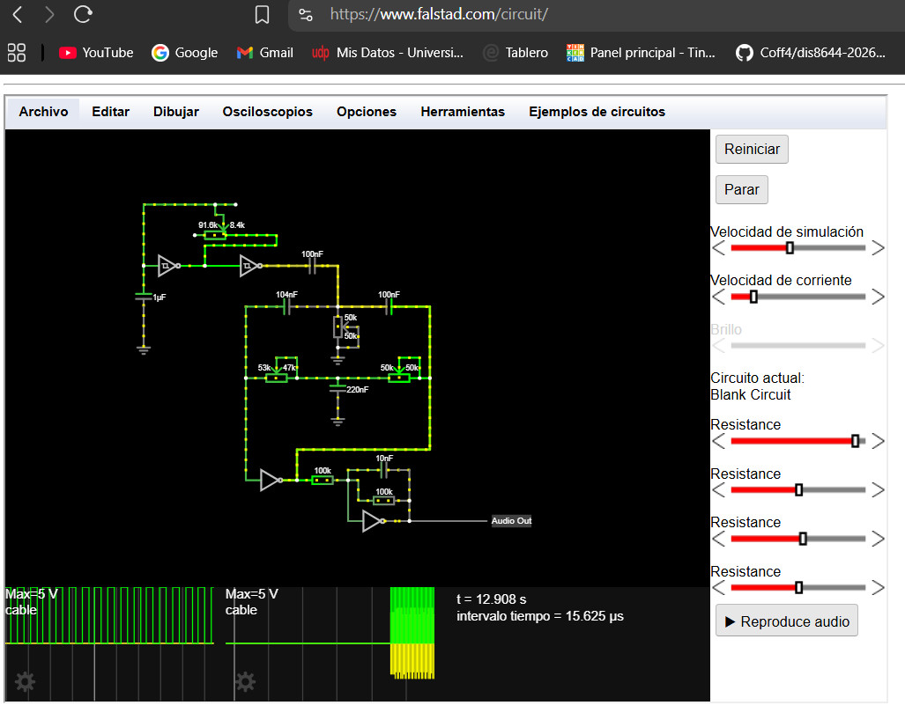

# sesion-10b
## 22 de mayo del 2026

### Desarrollo en clases

Estuvimos principalmente analizando el circuito para entender sus componentes y ver como podíamos reemplazar algunas piezas.
Lueego  

 Intentamos replicar el circuito en falstad, el cual no entendemos muy bien como se utiliza, pero logramos conseguir que se produjera un resultado de simulación del sonido, lamentablemente su frecuencia de onda era muy poco constante.

### Prueba uno
Al final de la clase intentamos hacer el circuito en la protoboard, pero este no sonó y no sabemos el por qué.

## Primer circuito percutor

### Logic noise drumb and filter percutor circuit - Elliot Williams

**Decidimos tomar este circuito de Hackaday debido a que es lo más cercano a poder ser realizado, además de ser uno que tiene una tonalidad decente. No es algo que nos guste en su totalidad, pero es más relevante que nos sirva. Aun así, uno puede modificar su tonalidad con los 4 potenciómetros que posee el circuito.**

### 4069

El circuito usa un chip **4069** irremplazable y esencial, ya que cumple la función de "corazón analógico". Este se usa como un amplificador analógico.

* Amplifica señales.
* Forma filtros activos.
* Genera oscilaciones senoidales.
* Produce el sonido del “drum”.
  
Nosotros tenemos el chip 4069BE, mientras que en el circuito original se utiliza un chip formato UBE.
La diferencia importante entre estos dos es que el BE es unbuffered (sin buffer interno), mientras que el UBE normalmente es la versión buffered estándar.

### 40106

Este chip sería el Schmitt trigger.

* Genera una onda cuadrada lenta (clock/LFO).
* Esa onda se convierte en un pulso de disparo (trigger).
* El trigger golpea el filtro Twin-T.
* El Twin-T “resuena” y produce el sonido percusivo.

[Logic Noise: Filters And Drums](https://hackaday.com/2015/03/25/logic-noise-filters-and-drums/)

