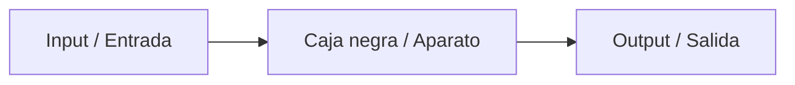
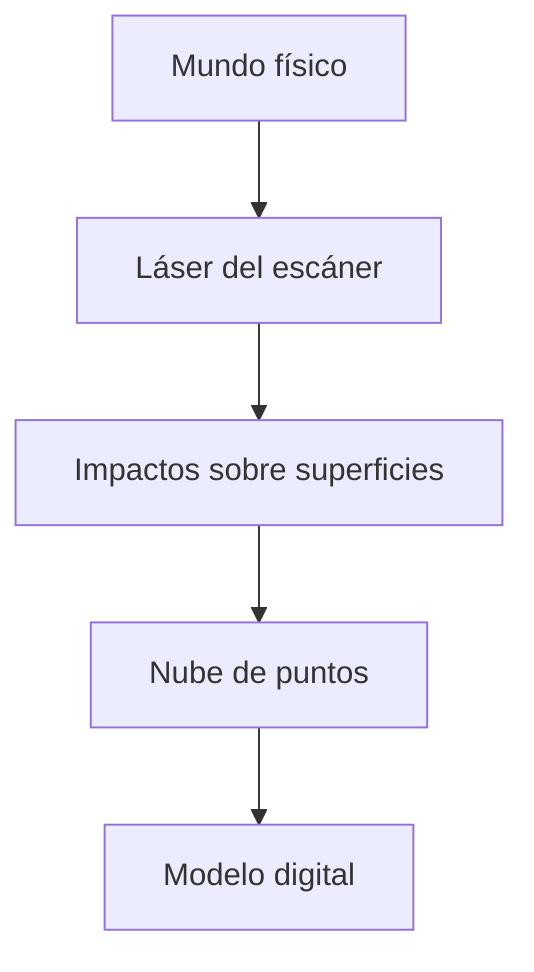
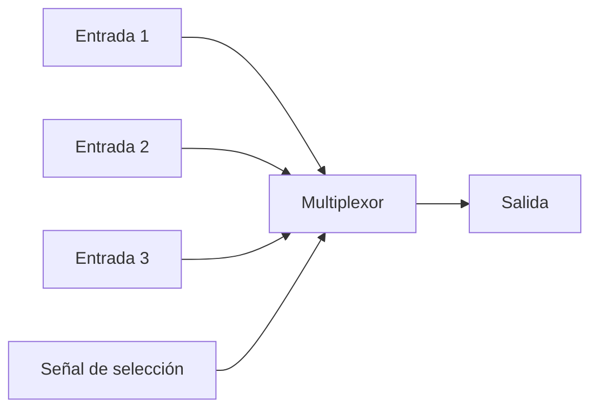

# 🌙 Clase 10a — Flusser, imágenes técnicas y control de voltaje

> **Bitácora de clase — 19 de mayo de 2026**  
> En esta sesión conectamos las ideas de Flusser sobre imágenes técnicas y aparatos con una charla artística sobre medición, escaneo 3D y sistemas inestables. Al final también revisamos conceptos electrónicos útiles para nuestros proyectos sonoros.

---

## ✨ Resumen general de la clase

En esta clase seguimos trabajando algunas ideas de **Vilém Flusser**, especialmente las relacionadas con la **imagen técnica**, los **aparatos** y la forma en que estos median nuestra relación con el mundo. Una de las ideas centrales fue que no vemos las cosas de forma completamente directa, sino a través de imágenes, textos, aparatos y sistemas que ordenan nuestra manera de mirar.

A partir de Flusser, se comentó que las imágenes y los textos son formas de construir mundo. Las imágenes tradicionales se desplazaron hacia espacios como los museos, mientras que los textos se dividieron hacia distintos lugares: la ciencia, los medios escritos, los diarios o los textos más cotidianos y masivos. Esto se relaciona con la idea de que cada sistema intenta representar la realidad, pero también la transforma.

Después tuvimos una charla sobre el proyecto **For Want of (Not) Measuring**, que trabaja con la medición, los sistemas inestables y las formas en que usamos herramientas técnicas para interpretar el mundo. El proyecto se inició en 2022 y ha ido creciendo a través de distintas exposiciones, colaboraciones y publicaciones.

La charla conectó muy bien con Flusser, porque mostraba cómo un aparato técnico, como un escáner 3D, no solo mide la realidad, sino que también produce una nueva imagen de ella. En vez de entregar una verdad absoluta, el aparato genera una versión del mundo hecha de puntos, cortes, superficies y errores. Esto hace visible que incluso los sistemas que parecen exactos pueden ser inestables.

Finalmente, la clase terminó con un repaso más técnico sobre control de voltaje, frecuencia y algunos chips que podemos usar en nuestros proyectos sonoros. Se revisaron componentes como el **4046**, el **4040**, el **4093**, el **555**, multiplexores y amplificadores operacionales.

---

## 📖 Repaso de Flusser

Durante la primera parte de la clase se retomaron ideas del libro **Hacia una filosofía de la fotografía**. Principalmente se habló de tres conceptos:

```text
Imagen
Imagen técnica
Aparato
```

Flusser plantea que las imágenes y los textos no son simplemente copias del mundo, sino formas de interpretarlo. Esto significa que nuestra relación con la realidad siempre está mediada por códigos, símbolos y aparatos.

Una idea importante fue que debemos intentar ver las cosas como son, pero entendiendo que muchas veces las vemos a través de imágenes o textos. Es decir, no accedemos al mundo de forma pura, sino mediante sistemas que lo organizan por nosotras.

---

## 🖼️ Imagen, texto y mundo

Según lo comentado en clase, las imágenes y los textos fueron ocupando distintos lugares dentro de la cultura.

| Elemento | Lugar o función | Valor asociado |
|---|---|---|
| Imagen tradicional | Museo / arte | Belleza |
| Texto científico | Ciencia | Verdad |
| Texto barato o masivo | Diario, celular, medios cotidianos | Utilidad / consumo |

Esta separación muestra cómo la cultura organiza distintas formas de representar la realidad. Las imágenes pueden quedar asociadas a lo artístico, los textos científicos a la verdad y los textos masivos a la circulación rápida de información.

Desde Flusser, esto es importante porque las imágenes técnicas aparecen como una nueva forma de reunir o transformar esas relaciones.

---

## 📷 Aparato como caja negra

Uno de los conceptos más importantes fue el de **caja negra**.

Un aparato puede entenderse como una caja negra porque recibe una entrada, realiza un proceso interno que no siempre comprendemos y entrega una salida.



En el caso de una cámara:

```text
Mundo exterior → Cámara → Imagen técnica
```

La cámara parece mostrarnos el mundo tal como es, pero en realidad produce una versión limitada y construida de ese mundo. La imagen resultante depende del aparato, de su programación, de sus límites técnicos y de la forma en que lo usamos.

Esto también se puede relacionar con nuestro imaginario sonoro y musical: muchas veces construimos nuestra idea del sonido a partir de los aparatos que usamos para producirlo, modificarlo o escucharlo.

---

## 🎤 Charla — *For Want of (Not) Measuring*

La charla trató sobre un proyecto iniciado en **2022**, que nació desde la intersección entre el trabajo de distintas personas creadoras. Con el tiempo, el proyecto se expandió hacia nuevas exposiciones, colaboraciones y publicaciones.

Uno de los temas principales fue la **medición**. El proyecto se pregunta qué pasa cuando usamos sistemas de medición para entender la realidad, pero también qué ocurre cuando decidimos no usarlos o cuando los usamos de maneras no convencionales.

Me llamó la atención que la charla no trataba solo sobre medir cosas, sino sobre cuestionar la confianza que tenemos en los sistemas que parecen exactos. A veces pensamos que una grilla, una medida o un escáner muestran la realidad de forma objetiva, pero al mirar más de cerca aparecen errores, diferencias, inestabilidad y posibilidades creativas.

---

## ⚖️ Medir el mundo

En la charla se mencionó una historia de hace aproximadamente **300 años**, cuando un grupo de personas intentó calcular el peso del mundo. Para hacerlo, subieron a una montaña en Escocia con instrumentos como péndulos y telescopios.

Esta historia servía como punto de partida para pensar en la medición como una práctica humana. Medir parece algo exacto, pero también depende de herramientas, contextos, errores, interpretaciones y decisiones.

La medición no es solamente técnica. También puede ser simbólica, política, artística y cultural.

---

## 🧊 Sistemas inestables

Uno de los conceptos que más apareció fue el de **sistemas inestables**.

La charla planteaba que algunos sistemas parecen estables porque tienen reglas, medidas o estructuras claras. Sin embargo, cuando se observan con más atención, se vuelven inestables.

Un ejemplo de esto es la **grilla**. A simple vista parece una estructura perfecta, cuadrada y ordenada. Pero dentro del proyecto se entiende como algo simbólico: una estructura que intenta ordenar el mundo, aunque el mundo real no siempre se deja ordenar perfectamente.

```text
Grilla = orden aparente
Mundo real = movimiento, error, cambio e inestabilidad
```

Esta idea se conecta con Flusser porque los aparatos también ordenan el mundo, pero no lo muestran de manera neutral.

---

## 🖨️ Escáner, láser y nube de puntos

Una parte importante de la charla fue la explicación del uso de un **escáner 3D**. Este aparato utiliza un láser que choca con el entorno físico y registra información del espacio.

El escáner no captura el mundo como una continuidad perfecta, sino como una gran cantidad de puntos. Cada punto corresponde a un impacto del láser contra una superficie.

A esta recopilación se le llama:

```text
Nube de puntos
```

La nube de puntos es interesante porque parece mostrar el mundo de forma muy precisa, pero en realidad es una reconstrucción fragmentada. El mundo real es continuo, mientras que el escaneo lo transforma en puntos separados.



Esto se relaciona con la imagen técnica, porque el escáner no solo registra la realidad: la transforma en un modelo digital producido por un aparato.

---

## 🌳 El árbol como red viva

Uno de los ejemplos más interesantes fue el escaneo de un árbol de más de **300 años**. En lugar de entender el árbol como un objeto sólido, se propuso verlo como una **red viva**.

El árbol no es una estructura fija. Está vivo, crece, se adapta y responde a las condiciones externas. Sus ramas pueden parecer relámpagos, ondas, frecuencias o sistemas de energía.

Esta idea me pareció importante porque cambia la forma de mirar. El árbol deja de ser solo “un árbol” y se convierte en una red de relaciones, fuerzas y tiempos.

También se habló de la escala temporal:

| Perspectiva | Relación con el tiempo |
|---|---|
| Para nosotras | El árbol parece lento |
| Para el árbol | Las personas somos rápidas |
| Para una montaña | El árbol también puede parecer rápido |

Al final, todo depende de la escala desde donde se mire.

---

## 🌀 Medición, juego y error

La herramienta de escaneo suele usarse para tareas técnicas, como medir edificios, registrar espacios o hacer modelos arquitectónicos. Sin embargo, en el proyecto se propone usarla de otra manera: no solo para medir, sino también para jugar, explorar y disfrutar el error.

Esto me pareció muy conectado con la idea de Flusser sobre los aparatos. Un aparato puede estar diseñado para cumplir una función técnica, pero también se puede usar de forma creativa, desviada o experimental.

El error deja de ser solamente una falla y puede convertirse en parte del resultado artístico.

```text
Uso técnico → medir correctamente
Uso artístico → explorar, jugar, deformar y descubrir
```

También se mencionó que hoy se pueden hacer experimentos similares desde el celular con aplicaciones como:

```text
Polycam
```

Esto muestra que algunas tecnologías que antes eran industriales o especializadas ahora están más disponibles para el uso cotidiano y experimental.

---

## 📚 Publicaciones y archivo

Otro punto interesante de la charla fue la idea de expandir el concepto de **publicación**. Por cada exposición, el proyecto genera publicaciones que reúnen pensamientos, textos, imágenes, registros y formatos especiales.

Estas publicaciones no son solo catálogos tradicionales. Funcionan como una forma de continuar el diálogo del proyecto y construir un archivo.

```text
Exposición → Publicación → Archivo → Nuevas conexiones
```

Cada exposición funciona como una nueva versión del proyecto, porque cambia según el lugar, las personas colaboradoras, el contexto y las conversaciones que aparecen.

---

## 🔌 Repaso técnico — Control de voltaje

Después de la charla, se hizo un repaso de conceptos electrónicos útiles para los proyectos.

Uno de los conceptos principales fue el **control de voltaje**. Para explicarlo se usó una comparación con una copa de agua: mientras más arriba está la copa, más presión tiene el agua.

Con el voltaje ocurre algo parecido: el circuito puede trabajar dentro de un rango, por ejemplo entre:

```text
0V y 9V
```

Ese espacio entre **Ground** y **VCC** puede entenderse como un lienzo donde los cambios de voltaje permiten modificar el comportamiento del circuito.

---

## 🎛️ 4046 — Voltaje a frecuencia

El chip **4046** fue explicado como una caja negra que puede convertir control de voltaje en frecuencia.

```text
Voltaje bajo  → frecuencia más lenta / sonido más grave
Voltaje alto  → frecuencia más rápida / sonido más agudo
```

Esto se relaciona con el concepto de **VCO**, que significa:

```text
Voltage Controlled Oscillator
Oscilador controlado por voltaje
```

Un VCO cambia su frecuencia dependiendo del voltaje que recibe. Por eso, si se modifica el voltaje de entrada, también cambia el tono o la velocidad de la oscilación.

---

## 🎚️ 4093, 555 y resistencia a frecuencia

También se mencionó que algunos circuitos permiten convertir cambios de resistencia en cambios de frecuencia.

Por ejemplo:

```text
4093 + 555 → resistencia a frecuencia
```

Esto se puede relacionar con el uso de potenciómetros, porque un potenciómetro es una resistencia variable. Al moverlo, cambia la resistencia y eso puede modificar el comportamiento del circuito, como la frecuencia o el tono.

---

## 🔢 4040 — Binary counter

El chip **4040** fue mencionado como un **binary counter** o contador binario.

Este tipo de chip permite dividir o contar pulsos. En términos simples, puede tomar una señal rápida y generar salidas más lentas o divididas.

```text
Entrada rápida → salidas divididas / más lentas
```

Esto puede servir para generar variaciones rítmicas, patrones o divisiones de una frecuencia principal.

---

## 🔀 Multiplexor

También se habló del **multiplexor**.

Un multiplexor permite elegir entre varias señales de entrada y decidir cuál de ellas saldrá por una salida común.



La idea principal es:

```text
Cada información es un voltaje
Una señal decide cuál voltaje sale
```

Esto puede ser útil para seleccionar entre distintas señales, tonos, controles o comportamientos dentro de un circuito.

---

## ⚙️ Otros componentes mencionados

| Componente | Idea principal |
|---|---|
| `4046` | Convierte voltaje en frecuencia. |
| `4093` | Puede usarse en circuitos que transforman resistencia en frecuencia. |
| `555` | Temporizador/oscilador útil para generar pulsos. |
| `4040` | Contador binario que divide señales. |
| Multiplexor | Selecciona una señal entre varias entradas. |
| Relé | Actúa como interruptor controlado eléctricamente. |
| `LM741` | Amplificador operacional. |
| `LM358` | Amplificador operacional. |
| `LM324` | Amplificador operacional múltiple. |

---

## 🌼 Ideas importantes que me quedaron

- Las imágenes técnicas no muestran el mundo de forma neutra: lo construyen mediante aparatos.
- Un aparato puede entenderse como una caja negra con entrada y salida.
- La cámara, el escáner y otros aparatos producen versiones acotadas del mundo.
- Medir no siempre significa acceder a una verdad absoluta.
- Los sistemas que parecen estables pueden ser inestables al observarlos con más detalle.
- Una nube de puntos reconstruye el mundo de manera fragmentada.
- El error técnico puede abrir posibilidades artísticas.
- El árbol puede entenderse como una red viva y no solo como un objeto.
- Todo depende de la escala desde donde se mire.
- El voltaje puede usarse como una forma de controlar frecuencia.
- El 4046 funciona como un VCO.
- El 4040 puede dividir señales y generar salidas más lentas.
- El multiplexor permite seleccionar entre distintas señales.

---

---

## 📸 Resumen — Capítulo 4: El acto de fotografiar

En el capítulo **“El acto de fotografiar”**, Flusser explica que fotografiar no es simplemente apretar un botón o capturar algo del mundo. Para él, el acto fotográfico ocurre dentro de una relación entre el **fotógrafo** y la **cámara**, donde ambos funcionan casi como una sola unidad.

El fotógrafo puede sentir que es libre porque decide qué fotografiar, desde qué ángulo hacerlo y qué tipo de imagen quiere producir. Sin embargo, esa libertad está limitada por el programa de la cámara. La cámara ya tiene inscritas ciertas posibilidades técnicas, y el fotógrafo solo puede moverse dentro de esas posibilidades.

```text
Fotógrafo + Cámara = acto fotográfico
```

Esto significa que la cámara no es una herramienta completamente neutra. Aunque parece obedecer al fotógrafo, también lo condiciona. El fotógrafo decide, pero decide dentro de lo que el aparato permite.

Flusser plantea que el fotógrafo puede elegir distintos objetos: un rostro, una galaxia, una escena cotidiana o incluso su propio reflejo. Pero todo lo que fotografía debe transformarse en una **situación apta para ser fotografiada**. En ese sentido, el mundo se adapta al programa de la cámara.

Una idea importante del capítulo es que no existe una fotografía completamente ingenua. Toda fotografía implica conceptos, decisiones y categorías. Incluso cuando alguien cree estar tomando una imagen espontánea, está usando criterios técnicos y culturales que ya están relacionados con el aparato.

El acto de fotografiar se parece a una especie de cacería. El fotógrafo se mueve, busca, duda, encuadra, ajusta y decide. Pero esta búsqueda no ocurre fuera del aparato, sino dentro de sus posibilidades. Por eso, fotografiar es también jugar contra la cámara: intentar producir una imagen que no sea completamente predecible.

```text
Fotografiar = buscar posibilidades dentro del programa de la cámara
```

En resumen, el capítulo muestra que fotografiar es un acto programado, pero no completamente cerrado. El fotógrafo puede intentar usar el aparato de forma creativa, buscando imágenes nuevas, improbables o informativas. La tensión principal está entre lo que el fotógrafo quiere hacer y lo que la cámara le permite hacer.

---

## 🖼️ Resumen — Capítulo 5: La fotografía

En el capítulo **“La fotografía”**, Flusser analiza qué es una fotografía y cómo debería ser interpretada. Parte señalando que las fotografías están en todas partes: revistas, libros, carteles, diarios, cajas, álbumes y objetos cotidianos. Por eso, muchas veces las miramos sin cuestionarlas.

El observador común suele pensar que una fotografía muestra una situación real que fue capturada automáticamente. Es decir, se cree que la fotografía es una copia directa del mundo. Sin embargo, Flusser dice que esta idea es engañosa.

La fotografía no es simplemente una ventana hacia la realidad. Es una imagen técnica producida por un aparato, y por eso contiene conceptos, decisiones y programas.

```text
Mundo exterior → Cámara → Fotografía
```

Uno de los ejemplos más importantes del capítulo es la fotografía en blanco y negro. Flusser explica que el blanco y el negro no existen como situaciones puras en el mundo real. Son conceptos teóricos relacionados con la luz. Por eso, una fotografía en blanco y negro no copia el mundo: transforma conceptos ópticos en imagen.

Lo mismo ocurre con la fotografía a color. Aunque parece más realista, también está construida desde conceptos técnicos y químicos. Para Flusser, mientras más “natural” parece una fotografía, más puede ocultar su origen técnico y conceptual.

```text
La fotografía parece natural,
pero está construida por conceptos y aparatos.
```

El capítulo también plantea que descifrar una fotografía significa entender las intenciones que están detrás de ella. No basta con mirar lo que aparece en la imagen. Hay que preguntarse qué quiso hacer el fotógrafo, qué permitió la cámara y qué programa técnico está actuando en esa imagen.

Flusser distingue dos fuerzas presentes en toda fotografía:

| Fuerza | Qué busca |
|---|---|
| Intención del fotógrafo | Expresar una idea, una mirada o un concepto. |
| Programa de la cámara | Realizar sus propias posibilidades técnicas. |

La fotografía surge del choque entre estas dos fuerzas. Por eso, una buena crítica fotográfica debería preguntarse hasta qué punto el fotógrafo logró dominar el programa de la cámara, y hasta qué punto la cámara terminó condicionando la imagen.

En resumen, Flusser plantea que las fotografías deben ser descifradas. Si las aceptamos de manera pasiva, pueden terminar programando nuestra forma de mirar, pensar y actuar. La fotografía no solo muestra el mundo: también nos enseña cómo verlo.

---

## 🧠 Reflexión personal sobre los capítulos 4 y 5

Estos capítulos me hicieron pensar que una cámara no es solo una herramienta para registrar momentos. Según Flusser, la cámara también decide, limita y guía la forma en que vemos el mundo. Uno puede creer que está tomando una foto libremente, pero en realidad esa libertad está atravesada por las posibilidades que el aparato ya trae programadas.

Me pareció interesante la idea de que fotografiar sea como un juego. El fotógrafo no solo usa la cámara, sino que juega contra ella, intentando encontrar una imagen distinta dentro de un sistema que ya tiene reglas. Esto se puede relacionar con otros aparatos que usamos en clase, como el escáner 3D o incluso los chips electrónicos. Todos reciben una entrada, procesan algo internamente y entregan una salida.

```text
Entrada → Aparato → Salida
```

La diferencia es que muchas veces no vemos lo que ocurre dentro del aparato. Por eso aparece la idea de la **caja negra**. Sabemos qué entra y qué sale, pero no siempre entendemos el proceso completo. Esto pasa con una cámara, con un escáner, con un celular o con un circuito integrado.

También me llamó la atención que Flusser diga que la fotografía no copia directamente la realidad. Aunque una foto parezca objetiva, siempre está construida por decisiones técnicas, conceptos y programas. Esto cambia la forma de mirar imágenes, porque obliga a preguntarse qué hay detrás de ellas.

Estos capítulos se conectan con la charla sobre medición y escaneo, porque el escáner también produce una imagen técnica del mundo. No captura la realidad completa, sino una versión hecha de puntos, datos y superficies. Al igual que la cámara, transforma el mundo en una imagen mediada por un aparato.

En conclusión, me quedo con la idea de que los aparatos no son neutros. Nos ayudan a crear, medir, registrar y escuchar, pero también condicionan la forma en que imaginamos el mundo. Por eso, usar un aparato de forma creativa implica entender sus límites y tratar de empujarlo más allá de lo que normalmente está programado para hacer.
