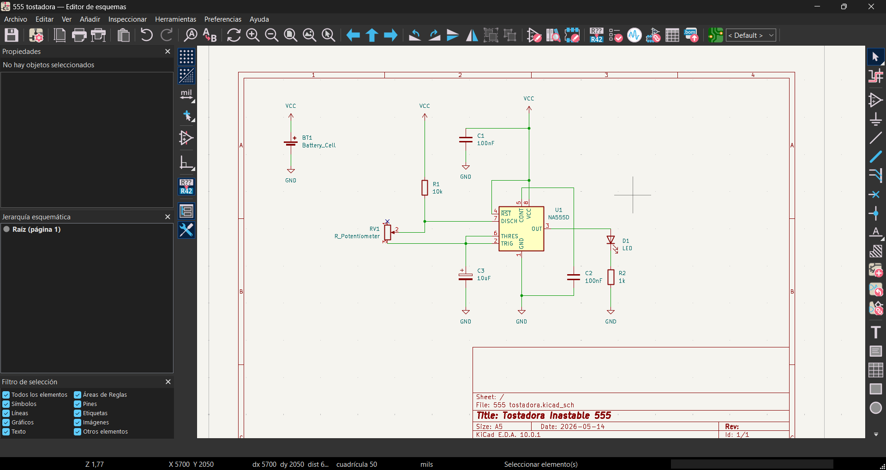
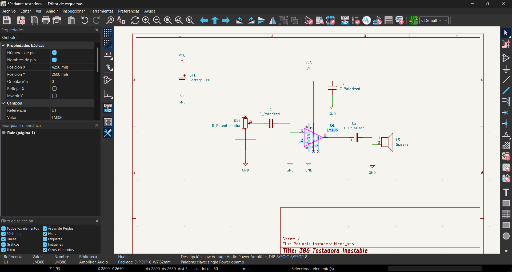
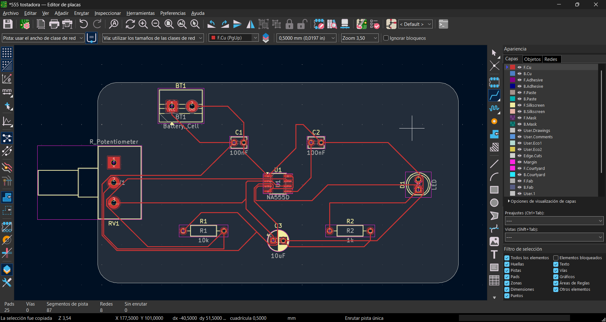
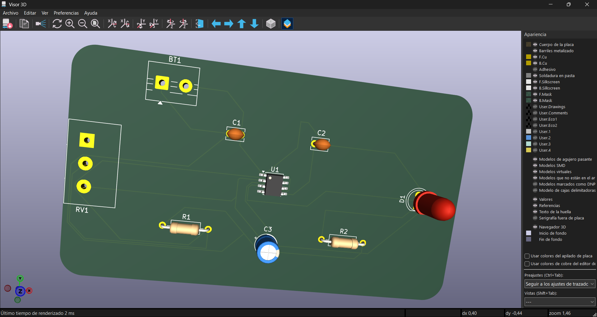
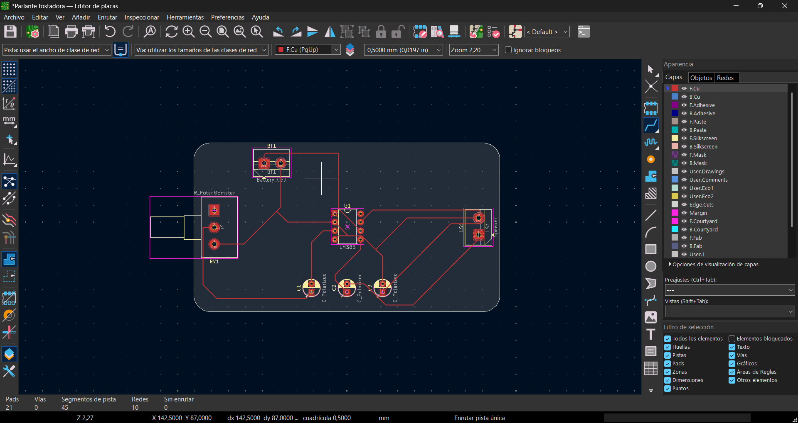
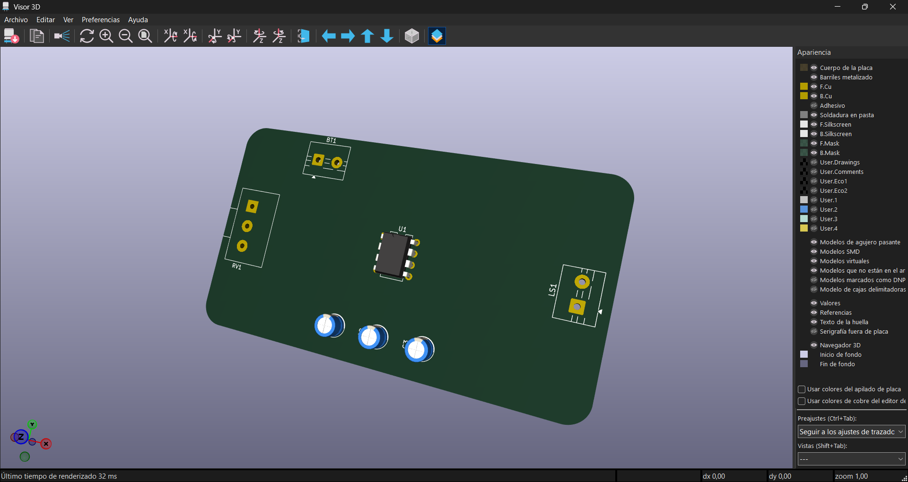
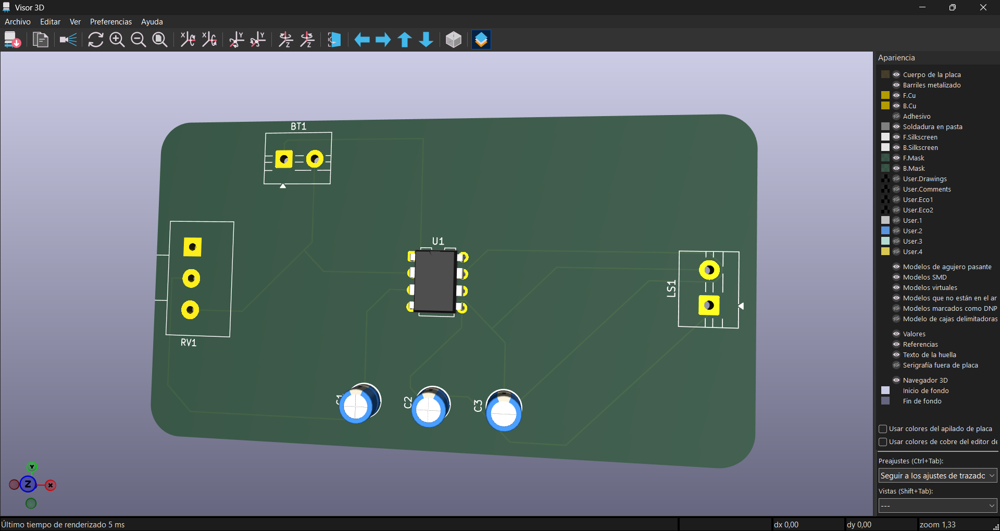

# sesion-09a
---

## Proceso:
Se nos dio la tarea de recrear 2 partes de nuestro ultimo proyecto y como no sabia como representar las conexiones entre los "steps" preferí hacer el 555 y el 386:

*Cabe aclarar que en su momento fue en papel al no saber usar KiCad*

Entonces como ya había practicado recientemente, se me hizo sencillo recrear ambos esquematicos (o bueno, más que sencillo, rapido)

y bueno, ya en la parte de la PCB ire un poco más en orden:

Primero realice el 555 con sus conexiones y todo, pero...viendolo me genera un toc horrible.

*se que los cables no pueden superponer otros como en el esquematico, pero eso complica tanto las cosas*

para finalizar su representación 3d:

SE QUE ES EL PRIMERO Y ME SIENTO ORGULLOSA DE HACERLO SOLA, pero se ve tan desordenado XC

Con el segundo modulo cambia un poco la cosa:

Aquí esta antes de las conexiones locas:

y ya finalizada:

Se puede leer un poco mejor pero debo preguntar por consejos para un mejor armado de aquí en adelante.

Pequeños consejos del video:

<https://www.youtube.com/watch?v=bb05LhJORSw>

- Siempre poner una batería para darle el poder a toda la placa.
- También se recomienda poner un LED para comprobar que la placa funciona correctamente.

---

## Dudas:

- ¿Cómo cambiar el ancho de todas las "vías" en vez de ir una por una?
- ¿Hay un tipo de prioridad que tener en cuenta a la hora de conectar las cosas?
- ¿Cómo se pueden optimizar las conexiones para que no sea tan caótico el "cableado"?
- ¿Por qué mi placa, aun redondeando los bordes en la previsualización, se ve rectangular?
- ¿Como representar las conexiones como por ejemplo de los steps?
- ¿Siempre de los siempres es necesario poner un led para ver que todo funcione?

---

Y eso es todo por este repo pequeñito, aunque creo que se me quedaron unas cosas en el aire como siempre. 	( ; ω ; ) 
